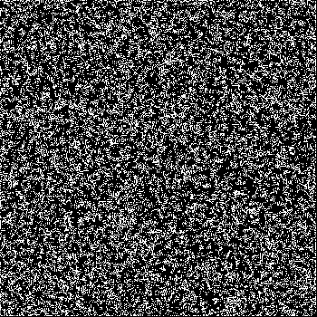

## Game of life

[Conway's Game of Life](https://en.wikipedia.org/wiki/Conway%27s_Game_of_Life) implementation in `Rust`.

- `gol` implementation: rnd
- `game_of_life` implementation: loosley following the code in the book: [Beginning Rust Programming](https://www.wiley.com/en-gb/Beginning+Rust+Programming-p-9781119712978)
